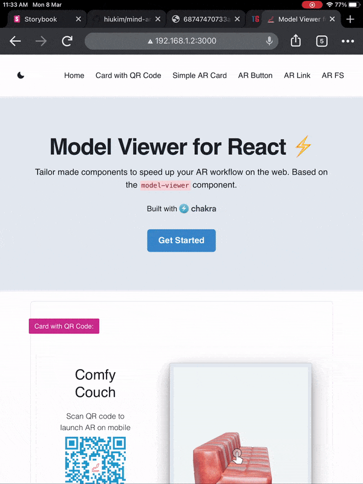

## Beautiful AR components made with Model Viewer and Chakra UI

By combining the forces of model viewer and Chakra UI, I'm creating React components to efficiently deliver AR capabalities to your web apps.

Pass the same attributes as you'd with model viewer. This is illustrated in the examples below.

---

#### Presenting 6 components that are already developed

###### 1. Card with QR Code (check out the site link on desktop browser for preview):

```javascript
<WithQRCode
  src={`${SampleModel.glbLink}&title=${SampleModel.title}&link=${SampleModel.link}`}
  ios-src={SampleModel.usdzLink}
  ar-modes="scene-viewer quick-look"
  ar
  ar-scale="auto"
/>
```

###### 2. Simple AR Card

```javascript
<ARCard
  src={`${SampleModel.glbLink}&title=${SampleModel.title}&link=${SampleModel.link}`}
  ios-src={SampleModel.usdzLink}
  exposure={currentExposure}
/>
```

###### 3. AR Button

```javascript
<ARButtonOnly
  src={`${SampleModel.glbLink}&title=${SampleModel.title}&link=${SampleModel.link}`}
  ios-src={SampleModel.usdzLink}
  ar-modes="scene-viewer quick-look"
  ar
  ar-scale="auto"
  reveal="manual"
/>
```

###### 4. AR Link

###### 5. QR to AR (bypass 3d view)

###### 6. AR Full View (checkout the navbar link)

**Note:** All the components have default props, so you can test them without passing any props.

---

#### Demo



---

#### Get Started

Clone the repo, install the dependencies and start the dev server.

```
git clone https://github.com/devhims/model-viewer-react.git
cd model-viewer-react
npm install
```

```
npm start
```

---

#### Motivation

I started working on React a few months ago and fell in love with the idea of reusable compoenents that can be customised with props. Model viewer web component makes it really easy to build cross-platform AR apps. Unable to find a React model viewer library for React, I started building my own components for differnet scenarios and reusing them in client projects. Here's hoping others will also find them useful.

---

#### Important:

There is a dependency on Chakra UI which is my go to React library for UI developement. I'd suggest sticking with it for this project.

---

### License

MIT
